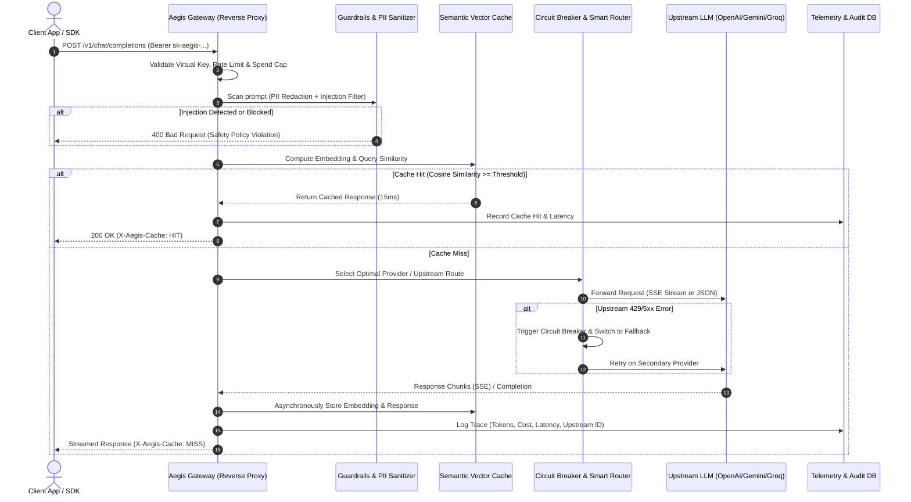

# Product Requirement Document (PRD): Aegis AI Gateway
**Enterprise-Grade LLM Middleware, Routing, Semantic Caching & Observability Engine**

---

## 1. Executive Summary & Problem Statement

### 1.1 The Industry Problem
In modern software engineering, directly calling LLM providers (OpenAI, Anthropic, Gemini, Groq, local vLLM) from application code introduces major production risks:
1. **Uncontrolled Cost & Token Burn**: Repeated or semantically identical queries hit upstream APIs repeatedly, burning budget and quota.
2. **Provider Outages & Rate Limits (429/5xx)**: Upstream APIs experience frequent latency spikes and outages. Hardcoding a single provider creates a single point of failure (SPOF).
3. **Data Security & PII Leakage**: Raw user inputs (containing emails, phone numbers, Indonesian NIK, credit cards, or internal API keys) are sent directly to external 3rd-party LLM providers without redaction.
4. **Zero Observability**: Engineering teams lack unified visibility into P50/P95/P99 latency, cost attribution per service/team, and token usage waterfall.

### 1.2 The Solution: Aegis AI Gateway
**Aegis** is a high-performance, developer-first AI Gateway and reverse proxy that acts as the single control plane between client applications and upstream foundation models. 

Aegis provides:
- **Sub-15ms Proxy Overhead**: Minimal latency added to requests.
- **Semantic Caching**: Embeds incoming queries and serves cached responses for semantically similar prompts ($\text{similarity} \ge 0.92$), reducing cost and latency to $<25\text{ms}$.
- **Smart Fallback & Circuit Breakers**: Automatic routing and tier-based failover (e.g., Groq $\to$ Gemini Flash $\to$ OpenAI GPT-4o-mini).
- **In-flight PII Masking & Prompt Injection Guardrails**: Sanitizes sensitive entities before sending payloads upstream.
- **Unified OpenAI-Compatible Contract**: Single drop-in endpoint (`/v1/chat/completions`) supporting full SSE streaming.
- **Infra-Grade Developer Console**: Non-generic, high-density observability dashboard designed with the ergonomics of Cloudflare, Datadog, and Linear.

---

## 2. System Architecture & Request Lifecycle



---

## 3. Core Functional Requirements

### 3.1 Unified OpenAI-Compatible Interface
- **Drop-in replacement**: Endpoints strictly mirror OpenAI standards:
  - `POST /v1/chat/completions` (JSON & `text/event-stream` SSE).
  - `GET /v1/models` (Aggregated list of available routed models).
  - `POST /v1/embeddings` (Unified embedding endpoint).
- **Custom Response Headers**:
  - `X-Aegis-Trace-Id`: Unique UUID for request debugging.
  - `X-Aegis-Cache`: `HIT` | `MISS` | `BYPASS`.
  - `X-Aegis-Upstream-Provider`: E.g., `groq`, `gemini`, `openai`.
  - `X-Aegis-Latency-Ms`: Total gateway processing time in ms.
  - `X-Aegis-Cost-USD`: Calculated cost based on input/output token usage.

### 3.2 Semantic Caching Engine
- **Embedding Generation**: Fast, lightweight local embedding (or ultra-fast remote embedding model) generating dense vectors for the user query.
- **Similarity Threshold**: Configurable cosine similarity threshold (default: `0.92`).
- **TTL & Invalidation**: Configurable Time-To-Live per model/route with manual instant cache purge via API or Dashboard.
- **Parameter Sensitivity**: Exact match required for temperature $> 0.0$ if deterministic output is not desired, or toggleable "fuzzy semantic mode".

### 3.3 Dynamic Routing, Fallbacks & Circuit Breaking
- **Routing Strategies**:
  1. **Cost-Optimized**: Routes to the lowest cost-per-token provider capable of handling the context window.
  2. **Latency-Optimized**: Routes to the provider with the lowest rolling P50 latency.
  3. **Priority Fallback List**: Ordered array (e.g. `[groq/llama-3.3-70b, google/gemini-1.5-flash, openai/gpt-4o-mini]`).
- **Circuit Breaker**:
  - Automatically trips after 3 consecutive failures (HTTP 429, 500, 502, 503, 504, or timeout $> 8000\text{ms}$).
  - Cooldown period: 30 seconds before half-open probe.

### 3.4 In-Flight Guardrails & PII Sanitizer
- **PII Redaction**:
  - Indonesian NIK (16-digit pattern recognition & Luhn check).
  - Indonesian & International Phone numbers.
  - Email addresses, Credit Card numbers.
  - API Keys / Bearer tokens accidentally pasted into prompts.
- **Action Modes**:
  - `Redact & Forward`: Replace with `[REDACTED_NIK]`, `[REDACTED_PHONE]`.
  - `Block & Alert`: Reject request immediately with HTTP 422.
- **Lightweight Prompt Injection Defense**: Fast heuristic and keyword rule engine detecting jailbreak prefixes (`"Ignore all previous instructions"`, `"DAN mode"`, etc.).

### 3.5 Virtual Key & Quota Management
- Virtual API keys (`sk-aegis-live-...`) generated for specific applications or teams.
- Granular controls:
  - Monthly / Daily Spend Cap (e.g., maximum \$50.00/month).
  - Rate Limits (Requests Per Minute - RPM, Tokens Per Minute - TPM).
  - Allowed Upstream Models whitelist.

### 3.6 Observability & Telemetry
- Real-time logging of all requests: Timestamp, Virtual Key ID, Model requested, Model actually served, Input/Output tokens, Total cost, Cache status, Latency breakdown.
- Exportable traces compatible with OpenTelemetry / Langfuse format.

---

## 4. UI/UX Design System Specification (Anti-AI Slop)

### 4.1 Design Philosophy & Aesthetic Directive
> **STRICT BAN ON AI SLOP:**
> - NO purple/neon cosmic gradient backgrounds.
> - NO floating sparkling stars, glowing humanoid robot avatars, or marketing fluff.
> - NO generic consumer chatbot interface as the primary screen.

**Design Target: Mission-Critical Infrastructure Console (Inspired by Cloudflare Dashboard, Datadog APM, Linear, Grafana, Stripe Dashboard)**
- **Palette**: Monochromatic zinc/neutral dark theme.
  - Background: Pure black (`#09090b`) and deep zinc canvas (`#121215`).
  - Cards & Panels: Elevated slate (`#18181b`) with crisp 1px borders (`#27272a`).
  - Text: Primary `#f4f4f5`, Secondary `#a1a1aa`, Muted `#71717a`.
  - Accents: Functional status colors only (Emerald `#10b981` for Healthy/200, Amber `#f59e0b` for Rate Limit/429/Fallback, Crimson `#ef4444` for Outage/5xx, Cyan `#06b6d4` for Cache Hit).
- **Typography**:
  - UI Font: Clean sans-serif (`Inter` or `Geist Sans`).
  - Code & Telemetry: Monospace (`Geist Mono` or `JetBrains Mono`) with tabular numbers (`font-mono tabular-nums`).
- **Information Density**: High density, compact padding, clear table grids, keyboard-navigable shortcuts (`/` for search, `Cmd+K` command palette).

### 4.2 Dashboard Views & Wireframe Layouts

#### View 1: Live Telemetry & Traffic Overview (Executive Ops)
- **Top KPI Strip**:
  - `Throughput`: Current QPS (Queries Per Second) with mini real-time sparkline.
  - `Cache Efficiency`: Overall hit rate `%` + total dollars ($) saved today.
  - `Latency Percentiles`: P50 (`142ms`), P95 (`480ms`), P99 (`1.2s`).
  - `Active Circuit Breakers`: Provider status pills (`OpenAI: UP`, `Groq: UP`, `Gemini: RECOVERING`).
- **Live Stream Waterfall Ticker**:
  - Compact data grid showing incoming requests in real-time.
  - Columns: `Status Badge (200 / 429 FB / CACHE)`, `Timestamp (HH:mm:ss.SSS)`, `Route`, `Latency`, `Tokens In/Out`, `Cost`, `Trace ID`.
  - Clicking any row opens a slide-over panel with the exact payload diff, PII redactions, and waterfall timing breakdown.

#### View 2: Route & Fallback Policy Visualizer
- Visual DAG (Directed Acyclic Graph) showing request flow:
  `Client Request` $\to$ `Guardrails` $\to$ `Semantic Cache` $\to$ `[Primary: Groq LLaMA 3.3]` $\xrightarrow{\text{on 429}}$ `[Secondary: Gemini 1.5 Flash]` $\xrightarrow{\text{on 5xx}}$ `[Tertiary: GPT-4o-mini]`.
- Interactive slider to test failover simulation and latency budgets.

#### View 3: Semantic Cache Inspector & Explorer
- Vector similarity distribution scatter plot.
- List of top cached prompts, hit count, last accessed, and instantaneous purge button.
- Query tester: Input a string to check if it matches existing vector clusters and what the similarity score is.

#### View 4: Virtual Key & Tenant Manager
- Key list with SHA-256 hashes, assigned owner, current spend vs budget limit bar, and instant revocation toggle.
- Copyable cURL and SDK integration snippets (Python `openai` client, TypeScript/Node.js).

---

## 5. Technical Stack & Local Constraints

To strictly honor the workspace rule **(RAM 16GB limit, lightweight local footprint, no heavy background watchers)**:

| Component | Technology | Rationale |
| :--- | :--- | :--- |
| **Gateway Core Engine** | **Bun / TypeScript** or **Go** | Extremely low memory footprint ($< 45\text{MB}$ RAM), $< 15\text{ms}$ cold start, native high-concurrency HTTP and SSE handling. |
| **Database & Analytics** | **SQLite (WAL Mode) via Bun:sqlite** | Zero background daemon overhead, zero external RAM usage. Strict `.gitignore` on `*.db`. |
| **Vector Storage (Cache)** | **sqlite-vec** or In-memory Cosine Index | Fast local vector similarity search without requiring heavy separate Docker containers. |
| **Frontend Console** | **Vite + React (Tailwind CSS + Lucide Icons + Tremor/Recharts)** | Lightweight, instant HMR, compiles to static files, fast builds that consume $< 200\text{MB}$ RAM. |
| **Deploy Target** | **Docker Compose / Standalone Binary** | One-command setup (`docker compose up`) for recruiters to review with 0 friction. |

---

## 6. Project Directory Structure

```text
aegis-gateway/
├── .gitignore               # Strict exclusion of *.db, *.db-wal, *.db-shm, .env
├── PRD.md                   # This specification document
├── README.md                # Architecture overview & portfolio showcase
├── docker-compose.yml       # Production one-click deploy
├── gateway/                 # Core Proxy & Middleware Service
│   ├── package.json
│   ├── tsconfig.json
│   └── src/
│       ├── index.ts         # Main HTTP server & router
│       ├── config.ts        # Environment & upstream credentials
│       ├── middleware/      # Auth, rate-limiter, request logger
│       ├── guardrails/      # PII redaction (NIK, phone, email) & safety check
│       ├── cache/           # Semantic vector cache & embedding generator
│       ├── router/          # Circuit breaker, model fallback, load balancer
│       ├── upstream/        # Upstream adapters (OpenAI, Anthropic, Gemini, Groq)
│       └── db/              # SQLite schema, migrations, and analytics queries
├── console/                 # High-Density Observability Web UI
│   ├── package.json
│   ├── src/
│   │   ├── components/      # UI components (Tables, Metrics, Flow diagrams)
│   │   ├── pages/           # Overview, Traces, Cache Explorer, Keys
│   │   └── lib/             # API client & formatting utils
└── benchmarks/              # Latency & throughput benchmark scripts
    └── load_test.sh         # wrk / k6 script proving sub-15ms overhead
```

---

## 7. Implementation Roadmap & Phases

- [ ] **Phase 1: Gateway Core & Multi-Provider Reverse Proxy**
  - Implement `/v1/chat/completions` supporting streaming (SSE) and non-streaming.
  - Upstream adapters: Groq, Gemini, and OpenAI.
  - Implement Circuit Breaker & Fallback mechanism.
- [ ] **Phase 2: Semantic Cache & In-Flight Guardrails**
  - Integrate vector embedding & cosine similarity cache.
  - Build Indonesian PII redaction engine (NIK, Phone, Email, Secrets).
- [ ] **Phase 3: Telemetry, Cost Engine & Analytics**
  - Log request metrics (P50/P95/P99 latency, tokens, cost calculation in USD & IDR).
  - Virtual API key management with spend limits.
- [ ] **Phase 4: High-Density Developer Console (Web UI)**
  - Build the dark, utilitarian, anti-AI-slop dashboard.
  - Real-time trace inspector, route flow graph, and cache manager.
- [ ] **Phase 5: Benchmarking, Documentation & Portfolio Polish**
  - Run k6/wrk benchmark tests showing latency overhead $< 15\text{ms}$.
  - Create architecture diagrams, interactive live demo, and GitHub README showcase.
