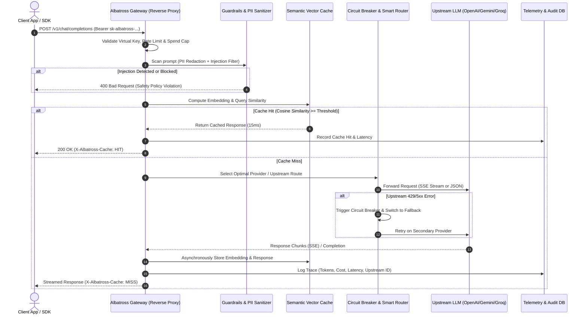

# Product Requirement Document (PRD): Albatross AI Gateway
**Enterprise-Grade LLM Middleware, Routing, Semantic Caching & Observability Engine**

---

## 1. Executive Summary & Problem Statement

### 1.1 The Industry Problem
In modern software engineering, directly calling LLM providers (OpenAI, Anthropic, Gemini, Groq, local vLLM) from application code introduces major production risks:
1. **Uncontrolled Cost & Token Burn**: Repeated or semantically identical queries hit upstream APIs repeatedly, burning budget and quota.
2. **Provider Outages & Rate Limits (429/5xx)**: Upstream APIs experience frequent latency spikes and outages. Hardcoding a single provider creates a single point of failure (SPOF).
3. **Data Security & PII Leakage**: Raw user inputs (containing emails, phone numbers, Indonesian NIK, credit cards, or internal API keys) are sent directly to external 3rd-party LLM providers without redaction.
4. **Zero Observability**: Engineering teams lack unified visibility into P50/P95/P99 latency, cost attribution per service/team, and token usage waterfall.

### 1.2 The Solution: Albatross AI Gateway
**Albatross** is a high-performance, developer-first AI Gateway and reverse proxy that acts as the single control plane between client applications and upstream foundation models. 

Albatross provides:
- **Sub-15ms Proxy Overhead**: Minimal latency added to requests.
- **Semantic Caching**: Embeds incoming queries and serves cached responses for semantically similar prompts ($\text{similarity} \ge 0.90$), reducing cost and latency to $<25\text{ms}$.
- **Smart Fallback & Circuit Breakers**: Automatic routing and tier-based failover (e.g., Groq $\to$ Gemini Flash $\to$ OpenAI GPT-4o-mini).
- **In-flight PII Masking & Prompt Injection Guardrails**: Sanitizes sensitive entities before sending payloads upstream.
- **Unified OpenAI-Compatible Contract**: Single drop-in endpoint (`/v1/chat/completions`) supporting full SSE streaming.
- **Infra-Grade Developer Console**: Non-generic, high-density observability dashboard designed with the ergonomics of Cloudflare, Datadog, and Linear.

---

## 2. System Architecture & Request Lifecycle

---

## 3. Core Functional Requirements

### 3.1 Unified OpenAI-Compatible Interface
- **Drop-in replacement**: Endpoints strictly mirror OpenAI standards:
  - `POST /v1/chat/completions` (JSON & `text/event-stream` SSE).
  - `GET /v1/models` (Aggregated list of available routed models).
  - `POST /v1/embeddings` (Unified embedding endpoint).
- **Custom Response Headers**:
  - `X-Albatross-Trace-Id`: Unique UUID for request debugging.
  - `X-Albatross-Cache`: `HIT` | `MISS` | `BYPASS`.
  - `X-Albatross-Provider`: E.g., `groq`, `gemini`, `openai`.
  - `X-Albatross-Latency-Ms`: Total gateway processing time in ms.
  - `X-Albatross-Cost-USD`: Calculated cost based on input/output token usage.

### 3.2 Semantic Caching Engine
- **Embedding Generation**: Fast, lightweight dense vector embedding generating dense vectors for the user query.
- **Similarity Threshold**: Configurable cosine similarity threshold (default: `0.90`).
- **TTL & Invalidation**: Configurable Time-To-Live per model/route with manual instant cache purge via API or Dashboard.

### 3.3 Dynamic Routing, Fallbacks & Circuit Breaking
- **Routing Strategies**:
  1. **Cost-Optimized**: Routes to lowest cost-per-token provider.
  2. **Latency-Optimized**: Routes to provider with lowest rolling P50 latency.
  3. **Priority Fallback List**: Ordered array (`[groq, gemini, openai]`).
- **Circuit Breaker**:
  - Automatically trips after 3 consecutive failures (HTTP 429, 500, 502, 503, 504, or timeout $> 15000\text{ms}$).
  - Cooldown period: 30 seconds before half-open probe.

### 3.4 In-Flight Guardrails & PII Sanitizer
- **PII Redaction**:
  - Indonesian NIK (16-digit pattern recognition & Luhn check).
  - Indonesian & International Phone numbers.
  - Email addresses, Credit Card numbers.
  - API Keys / Bearer tokens accidentally pasted into prompts.
- **Action Modes**:
  - `Redact & Forward`: Replace with `[REDACTED_NIK]`, `[REDACTED_PHONE]`.
  - `Block & Alert`: Reject request immediately with HTTP 422.

---

## 4. UI/UX Design System Specification (Anti-AI Slop)

> **STRICT BAN ON AI SLOP:**
> - NO purple/neon cosmic gradient backgrounds.
> - NO floating sparkling stars, glowing humanoid robot avatars, or marketing fluff.
> - NO generic consumer chatbot interface as the primary screen.

**Design Target: Mission-Critical Infrastructure Console (Cloudflare, Datadog APM, Linear, Grafana)**
- **Palette**: Monochromatic zinc/neutral dark theme (`#09090b` and `#121215`), elevated slate panels (`#18181b`), border 1px (`#27272a`).
- **Typography**: Sans-serif (`Inter`) + Monospace (`Geist Mono`) with tabular numbers (`tabular-nums`).
- **Information Density**: High density, compact padding, clear table grids, request waterfall, and live inspector.
